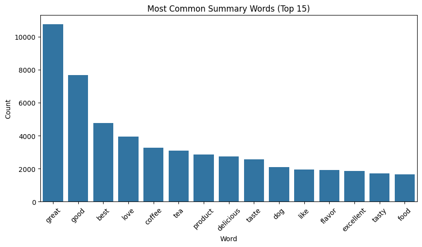

<center>
<h1>Building a Text Summarizer</h1>
</center>

# Introduction
Text summarization is the process of condensing a piece of text to extract the most important information while maintaining the essential meaning of the original content. It aims to generate shorter versions of documents, articles, or other written materials while preserving the key ideas.

### Types of Text Summarization
**Extractive Summarization:** This technique involves selecting important sentences or phrases from the original text without altering them. The system ranks sentences based on importance and arranges them to create a summary. e.g. TextRank, LexRank.

**Abstractive Summarization:** Instead of directly extracting sentences from the text, abstractive models understand the context and rewrite the content using new words and sentences. This method mimics how humans summarize by paraphrasing.
e.g. Transformer-based models.

_This project is built upon **abstractive summarization**_.

# Problem Statement

The main goal of this project is to build a text summarizer without an LLM by using architectures and techniques we reviewed in class.

# Dataset
The used dataset is [**Amazon Fine Food Reviews**](https://www.kaggle.com/datasets/snap/amazon-fine-food-reviews).
It consists of reviews of fine foods from amazon. The data span a period of more than 10 years, including all ~500,000 reviews up to October 2012. Reviews include product and user information, ratings, and a plain text review. It also includes reviews from all other Amazon categories.

The main columns are **text**, **summary** and **score**.

<center>
  
</center>

# Data Analysis
### Original dataset
100,000 records were considered from the whole ~500,000 for convenience in terms of computational resources and training time.


The length distribution describes relatively short sequences with some outliers. In non-summarized text there's lengths between 0 and 200, up to 2500 tokens. The summaries are mostly between 1 and 6 tokens.

<center style="width:100%; display: flex;">
    
    
</center>

<br/>

The most common words for the non-summarized texts are dominated by the pronoun "I" and line breaks (br). The most common words in the summaries are positive words and can be seen a superior count for the "Great" word.

<center style="width:100%; display: flex;">
    
    
</center>

<br/>

Looking at the "score" column, most reviews are positive (5 points) and that reflects the high frequencies of certain positive words like "Great", not to mention it's clearly a popular word to express that something is good.

<center >
    
</center>


### Cleared dataset
The data was preprocessed by expanding contractions, changing to lowercase, deleting line breaks. replacing repeated whitespace.
Also, non-summary text of length of more than 200 was removed to avoid too long sequences.

After this, 82836 records were left to use.

<center style="width:100%; display: flex;">
    
    
</center>

<br/>

The most common words for the non-summarized texts are dominated by the pronoun "I" and line breaks (br). The most common words in the summaries are positive words and can be seen a superior count for the "Great" word.

<center style="width:100%; display: flex;">
    
    
</center>


# Methodology

- Three different implementations were built:
1. GRU encoder, GRU decoder.
2. GRU encoder, GRU decoder, GloVe (6B, 200 dim).
3. Transformer, Glove (6B, 200 dim).

- Compared Rouge between the models.
- Generated sample summaries.

# Results

<center>

| Model                           | Rouge    |
|---------------------------------|----------|
| GRU encoder, GRU decoder, GloVe | 0.337545 |
| GRU encoder, GRU decoder        | 0.166411 |
| Transformer, GloVe              | 0.054819 |

</center>

### GRU encoder, GRU decoder

```
Input: some pre mixed food products are too heavy on the salt for my taste but shake n bake has a good balance of 
seasoning just as an experiment we tried using them as breadcrumb substitute for meatballs and they were quite good
as well this product provides a tasteful balance of seasoning and is a versatile recipe ingredient
Target: good seasoning and versatile
Output: good stuff not it amount amount sodas sodas sodas
Rouge: 0.1538461595773697
----
Input: i absolutely love this coconut water amazing taste pure i have read food critics reviewing the labels 
description on zico pure premium coconut water compared to other coconut water products and it ranked highest a far
as vitamins and everything listed on the labels were actually true other products were overstated great after work 
out
Target: coconut water
Output: best water it cake kits sodas sodas sodas sodas sodas
Rouge: 0.1666666716337204
----
Input: i do not know why one reviewer said the orange flavor was overpowering i find it has an excellent taste and 
nice orange aroma love the tea and have been drinking it several times a day i am buying more
Target: excellent orange aroma
Output: great tea tea tea teas teas teas teas teas teas
Rouge: 0.0
----
Input: i do not care how good the chocolate is shipping on a candy bar is a total ripoff do not order from these 
pirates
Target: total ripoff
Output: good ripoff cookies amount amount blend etc etc etc sodas
Rouge: 0.1666666716337204
```

<center>
  
</center>

This achieved a mean Rouge of 0.16641193628311157.

### GRU encoder, GRU decoder, GloVe (6B, 200 dim)

```
Input: i drink one to two of these k cups a day have been doing so for mos now love it perfect tea not bitter not 
weak i have come across the occasional k cup with a bad lid seal and it will blow the grinds into the cup then but 
i choose not to get worked up over the failure of a cent item when the others in the pack are fine edit ok i have 
to agree with the other reviewer a little more the quality of these k cups is inconsistent and they do blow grinds 
more often then they should i am still drinking this tea as much as ever as the flavor is not replicated in any 
other brand edit it is june now and this is still my main drink the k cup blowout issues seems to have been 
resolved in the last few boxes they must have fixed the problem a great tea
Target: perfect cup of tea
Output: great for of tea
Rouge: 0.5
----
Input: i have gained weight not telling you how much over the months and am putting myself on a diet these chips 
have saved me from gorging on the bad stuff becaue of their taste this product is not only healthy but it actually 
tastes the best out of all of my other possible options frito lay is the thing of the past because pop chips are in
i strongly recommend this to anybody trying to maintain or lose weight because with snacks like this you can keep 
the love handles off thank you pop chips for a successful diet go to for any more info on how they are made
Target: most delicious chips ever
Output: best sensible chips ever
Rouge: 0.5
----
Input: i love these candies however the entire case was ruined not one piece was not damaged obviously they had 
melted either prior or during shipping the chocolate was stuck to the top of the paper they are wrapped in they 
were still edible but did not quite taste the same the chocolate was gooey instead of solid even days later when 
stored at room temperature they really disappointed me so i am hoping the next case i purchase will be fresh as i 
am ordering in october a cooler month and hoping it was ruined in delivery and not the sellers storage
Target: chocolate melted
Output: melted melted melted
Rouge: 0.4000000059604645
----
Input: recently i was forced to be on a gluten and dairy free diet for a few months i have two young children and i
am busy and finding quick relatively tasty and easy gluten and dairy free options is tough i love thai food but 
never harbored any false notions that this would taste remotely authentic when was the last time you tasted 
something out of a package that tasted authentic or even remotely good for that matter also i tend to stick with 
whole foods and avoid packaged processed foods no matter how healthy as much as possible anyway i was surprised 
that i enjoyed this i still eat them and i am off the restricted diet salty yes but i love salty foods and you have
to have a microwave that can adjust it is power to most do these days and they talk about the noodles fluffing up 
which mine never did lastly it is not cheap and it is definitely a small meal but at the end of the day it is a 
tasty option for those who can not have gluten or dairy products it is actually vegan too
Target: tasty option for gluten dairy free
Output: great but for a free free
Rouge: 0.3333333432674408
----
Input: not only did of the bags arrive popped the smell of the product is enough to sending you running to the 
toilet these are soaked in water and smell of potent rotten fish i would not give this product to a starving 
homeless person they are so nasty smelling grosss
Target: rotten fish goop
Output: bad fish goop
Rouge: 0.6666666865348816
----
Input: we love our keurig coffeemaker and have tried many coffees recently discovered wolfgang puck is new line of 
coffees and are pleased with all of his we have tried this one is smooth with a great flavor no bite we would 
purchase this again
Target: great coffee
Output: great coffee
Rouge: 1.0
```

<center>
  
</center>

This achieved a mean Rouge of 0.33754509687423706.

### Transformer, Glove (6B, 200 dim)

```
TEXT:  this tea is very good and the packaging helps keep it fresh i use it in my keurig to make ice tea mostly although sometimes i make hot tea the aroma is wonderful and just what i am looking for in an earl grey i will continue to purchase
TARGET: excellent
PRED: great tea
ROUGE: 0.0
----
TEXT:  i ordered two pound bags of these candied orange peels the quality and flavor were great i dipped them in chocolate and everyone raved about them shipping was quick and reliable
TARGET: great product reliable shipping
PRED: not as advertised
ROUGE: 0.0
----
TEXT:  the infamous goose is a very inexpensive sauvignon blanc at about per bottle but it packs in flavor as is typical of this variety from marlborough new zealand it is very citrus y the flavor of grapefruit hits you at once and continues to the bottom of the glass others with perhaps more refined palates taste a variety of different fruits lemongrass and honey but to me it is grapefruit all the way it is got good body and is a wonderfully fresh drink one that goes with a wide variety of foods you can hardly beat the price try it once and then buy a case
TARGET: great flavor amazing value
PRED: great product
ROUGE: 0.3333333432674408
----
TEXT:  these sour cherries are not too sweet and you can not eat just one great buy
TARGET: great tasting can not eat but one
PRED: not as advertised
ROUGE: 0.20000000298023224
----
TEXT:  we use a lot of coconut milk in our house in addition to cooking with it we use it in our coffee every morning i have purchased this brand before native forest organic classic and the coconut milk was rich and creamy the bpa free can was also a strong selling point for me however i am very disappointed with this last shipment i received there is a pronounced reduction in quality watery milk with large gritty chunks of fat no creaminess at all i see from the other recent comments that other customers have experienced the same disappointment the lower price and bpa free cans become less attractive when you are receiving a sub standard product especially a case of it i would rather pay more for the other brand i purchase natural value organic coconut milk and get a higher quality product
TARGET: quality unacceptable used to be better
PRED: not as expected
ROUGE: 0.0
----
TEXT:  while clearly distinct from a href http www amazon com gp product b ofnl c maynards wine gums roll pack a these are perfectly acceptable wine gums a little sweeter and a little less chewy but still a definite tartness to the flavoring and that satisfying solidity that is wholly missing from the gummis and their relatives
TARGET: chewy and not too sweet
PRED: not bad
ROUGE: 0.2857142984867096
----
TEXT:  we originally bought these because of a promotion but because they are the best raisins out there we recently took our sixth shipment from amazon the pack of canisters is good for a family of four for about months the discount for subscribe and save helps out and you can cancel if you do not want to receive anymore without penalty
TARGET: great raisins
PRED: not bad
ROUGE: 0.0
```

<center>
  
</center>

This achieved a mean Rouge of 0.05481997786498651.

# Conclusions
- Best Rouge for the GRU with GloVe model, although all models have a relatively low Rouge in general.
- The transformer didn't reach the expected results. Increasing the epochs for it's training may increase its quality as it can be seen that both loss curves kept descending at the end of training, but have to take care of overfitting.
- A bias inclined to predict some words (e.g. great, good) is noticeable. Probably a sign of overfitting. Balancing the dataset in order to have too many positive reviews may reduce that bias.
- Using more data may help to enhance performance.

<br/>

**You can check the code in [GitHub](https://github.com/bryancalisto/nlp-labs/blob/main/final-project/nlp_final_project.ipynb).**